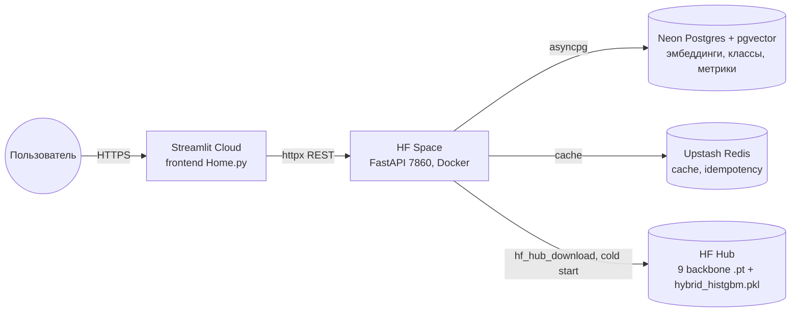

# Классификация архитектурных стилей

Сервис: https://archstyle55-hse.streamlit.app/

Код обучения, оценки, сегментации, XAI и формирования отчётов для классификатора 55 архитектурных стилей. Сервис в `service/` использует обученные веса и часть модулей этого пакета.

## Что сделано

- Датасет ~20 880 изображений, 55 классов, stratified 70/15/15 split (seed=42).
- Обучены 9 supervised backbone на одинаковом конвейере: ResNet-50, EfficientNet-B0/B2/B3, EfficientNet-V2-S, ConvNeXt-Small, ViT-B/16, Swin-V2-T, DINOv2 ViT-B/14 (linear probe).
- Запущены два zero-shot baseline (CLIP ViT-B/16 и SigLIP-B/16-224).
- Собран ансамбль top-3 (soft-voting, uniform и weighted) после temperature scaling.
- Гибрид DINOv2 + 30 атрибутов SegFormer-сегментации поверх HistGradientBoostingClassifier.
- Ablation: переобучение V2-S на 54 классах без шумного "Late 20th century Moscow architecture".
- Калибровка через temperature scaling, ECE/MCE до и после, reliability-диаграммы.
- XAI: Grad-CAM++ для CNN, Attention Rollout и Chefer-relevance для ViT/DINOv2.
- Compute cost: параметры, GFLOPs, inference latency на CPU.

## Датасет

| Параметр | Значение |
| --- | --- |
| Изображений | ~20 880 |
| Классов | 55 |
| Источники | Wikimedia Commons, Openverse (CC-only), архив автора |
| Минимальный класс | Pueblo Revival, 199 изображений |
| Максимальный класс | Gothic Revival, 720 изображений |
| Split | 70/15/15 stratified, 3 138 в test |

Сами изображения в репозитории не хранятся. Сплиты зафиксированы в `pipeline/results/splits/manifest.csv`. В `results/embeddings/` лежат только производные DINOv2-эмбеддинги (768-D, frozen). 


## Тренировочный конвейер

`pipeline/training/loop.py`:

- EMA весов (decay=0.9995), оценка идёт на EMA-копии.
- MixUp (a=0.2) и CutMix (a=1.0) с равной вероятностью, label smoothing 0.1.
- AdamW, wd=0.05, two-group LR (head в 10x выше backbone), cosine + linear warmup 10%.
- Early stopping по val accuracy, patience 6, restore best.
- На каждый запуск пишется `repro.json` (commit, env, dataset hash, args).

Аугментации: RandAugment(n=2, m=10), ColorJitter(0.3, 0.3, 0.3), RandomErasing(p=0.25), letterbox-resize до 224 или 384 (для V2-S и B3).

## Результаты (test, 55 классов)

| Модель | acc | acc 95% CI | macro-F1 | bal-acc | best epoch |
| --- | --- | --- | --- | --- | --- |
| ensemble_top3_uniform | 0.7852 | 0.7693, 0.7992 | 0.7799 | 0.7803 | - |
| ensemble_top3_weighted | 0.7833 | 0.7677, 0.7973 | 0.7781 | 0.7784 | - |
| efficientnet_v2_s_abl54 (54 cls) | 0.7786 | 0.7644, 0.7926 | 0.7738 | 0.7752 | 35 |
| efficientnet_v2_s | 0.7623 | 0.7463, 0.7772 | 0.7582 | 0.7595 | 35 |
| dinov2_vitb14_linear | 0.7467 | 0.7313, 0.7610 | 0.7374 | 0.7415 | 13 |
| convnext_small | 0.7419 | 0.7253, 0.7562 | 0.7384 | 0.7388 | 30 |
| efficientnet_b3 | 0.7412 | 0.7256, 0.7569 | 0.7356 | 0.7379 | 35 |
| efficientnet_b2 | 0.7161 | 0.6992, 0.7320 | 0.7096 | 0.7139 | 30 |
| resnet50 | 0.7103 | 0.6938, 0.7259 | 0.7039 | 0.7062 | 30 |
| vit_b16 | 0.7084 | 0.6909, 0.7243 | 0.7034 | 0.7062 | 30 |
| efficientnet_b0 | 0.7004 | 0.6845, 0.7158 | 0.6947 | 0.6975 | 30 |
| swin_v2_t | 0.4503 | 0.4324, 0.4669 | 0.4214 | 0.4256 | 24 |
| siglip_b16_224 (zs) | 0.4308 | - | 0.4044 | - | - |
| clip_vit_b16 (zs) | ~0.36 | - | - | - | - |

Bootstrap 95% CI - 1 000 ресемплов на test (3 138). Попарные сравнения - McNemar test (`results/pairwise_mcnemar.csv`, 91 пара). Ансамбль top-3 значимо обгоняет любую одиночную модель (p < 0.001).

## Калибровка

Temperature scaling на val, минимизация NLL, ECE/MCE с n_bins=15. Все артефакты в `results/calibration/`.

| Модель | T | ECE pre | ECE post |
| --- | --- | --- | --- |
| efficientnet_v2_s | 1.21 | 0.058 | 0.018 |
| convnext_small | 1.16 | 0.052 | 0.020 |
| dinov2_vitb14_linear | 0.94 | 0.034 | 0.022 |
| clip_vit_b16 (zs) | 0.012 | 0.41 | 0.04 |
| siglip_b16_224 (zs) | 0.013 | 0.39 | 0.04 |

CLIP/SigLIP в этом домене требуют экстремального масштабирования логитов (T ~ 0.012, то есть x80) - сырые softmax-вероятности недоверчивы.

## Ансамбли

Soft-voting после temperature scaling, веса подобраны на 50/50 stratified split, чтобы не протекать в финальную оценку.

- `top3_uniform` - равные 1/3 для V2-S, ConvNeXt-S, DINOv2-linear.
- `top3_weighted` - simplex grid с шагом 0.1, оптимум ~0.4/0.3/0.3.

Uniform чуть лучше weighted (acc +0.19 п.п., F1 +0.18 п.п.) - модели сравнимой силы.

## Гибрид DINOv2 + SegFormer-attrs

DINOv2-эмбеддинг (768-D) + 30 интерпретируемых атрибутов фасада из SegFormer (доли стен/окон/крыши, симметрия и т.д., `pipeline/segmentation/extract_attributes.py`), HistGradientBoostingClassifier.

| Вариант | acc | macro-F1 |
| --- | --- | --- |
| attr_only | 0.2814 | 0.262 |
| emb_only (DINOv2) | 0.7301 | 0.722 |
| hybrid (emb + attrs) | 0.7371 | 0.728 |

Прирост +0.70 п.п. над `emb_only` не значим (McNemar p=0.12). Stacking-вариант (top-3 probs + attrs) на 50/50 split даёт 0.7718, чуть хуже uniform top-3 ensemble (0.7782, p=0.48). В сервисе используется только основной hybrid (`results/hybrid_histgbm.pkl`).

## Ablation: 54 класса

Идентичный V2-S без класса "Late 20th century Moscow architecture" (recall в base-модели 0.5%, таксономически шумная категория).

| Конфигурация | acc |
| --- | --- |
| V2-S 55 cls на 55 cls test | 0.7623 |
| V2-S 55 cls на test без drop class | 0.7709 |
| V2-S 54 cls на 54 cls test | 0.7786 |

Чистый прирост от переобучения +0.78 п.п. поверх post-hoc эффекта. Соседние категории заметно подросли: Stalinist +0.119, Constructivist +0.100, Naryshkin Baroque +0.085, Brutalist +0.083 recall. Подробности - `results/ablation_v2s/ablation_per_class.md`.

## XAI

CNN - Grad-CAM++ (`pipeline/xai/cam.py`). ViT/DINOv2 - Attention Rollout и Chefer-LRP relevance (`pipeline/xai/transformer_xai.py`). У DINOv2 attention распределено более равномерно, чем у supervised ViT-B/16 - class-specific сигнал лучше показывать через Chefer relevance, а не через сырой rollout.

```bash
python -m pipeline.reports.xai_showcase --run efficientnet_v2_s_seed42 --layer features.6
python -m pipeline.reports.xai_showcase_vit
python -m pipeline.reports.xai_showcase_dinov2
```

Live-XAI доступен в сервисе на странице `Try the model`.

## Compute cost

`pipeline/reports/compute_cost.py`, M1 CPU, batch=1, среднее по 50 прогонам.

| Модель | params (M) | GFLOPs | inference (мс) | acc |
| --- | --- | --- | --- | --- |
| efficientnet_b0 | 4.0 | 0.4 | ~95 | 0.7004 |
| efficientnet_b3 | 10.7 | 1.0 | ~170 | 0.7412 |
| efficientnet_v2_s | 20.2 | 2.9 | ~260 | 0.7623 |
| convnext_small | 49.4 | 4.5 | ~410 | 0.7419 |
| resnet50 | 23.5 | 4.1 | ~360 | 0.7103 |
| vit_b16 | 85.7 | 17.6 | ~720 | 0.7084 |
| dinov2_vitb14_linear | 86.6 | 11.6 | ~660 | 0.7467 |

Pareto-плот - `results/compute_cost_bubble.png`. Лучший компромисс качество/скорость на CPU - EfficientNet-V2-S и ансамбль top-3.

## Архитектура сервиса

Backend: <https://kkkaredaw-archstyle55-backend.hf.space>. Веса: <https://huggingface.co/kkkaredaw/archstyle55-backbones>.



Бэкенд:

- `POST /predict/single`, `/predict/ensemble`, `/predict/hybrid`
- `POST /segment` - SegFormer-сегментация фасада (overlay или JSON-атрибуты)
- `POST /xai/cnn`, `/xai/vit` - Grad-CAM++ и Attention Rollout / Chefer relevance
- `POST /search/similar` - kNN по DINOv2-эмбеддингам через pgvector
- `GET /meta/models`, `/meta/classes`
- `POST /feedback`
- `GET /docs` - Swagger UI

Стэк: FastAPI + asyncpg + slowapi + Prometheus client + structlog. Ленивая загрузка моделей через LRU-registry (`MODEL_LRU_SLOTS=3`), чтобы умещаться в 16 GB RAM HF Spaces free. Подробности - `service/README.md`, `service/DEPLOY_LIVE.md`.

## Структура каталога

```
pipeline/
  config.py
  data/        prepare_splits, dataset, transforms, rectify, color_features, color_baseline
  models/      factory (9 backbone), two_stream
  training/    loop, scheduler, mixers, ema, logger, repro, run
  evaluation/  evaluate, calibration, stat_tests, ensemble, tta, clip_zeroshot
  segmentation/ segmentor, run_segmentation, extract_attributes, hybrid, hybrid_emb, hybrid_stacking
  xai/         cam (Grad-CAM++/Score-CAM/Eigen-CAM), transformer_xai (rollout, Chefer LRP), prototypes
  reports/     figures, embeddings, error_gallery, compute_cost, aggregate_runs
  scripts/     pack_dataset, draw_pipeline, multi_seed, make_ablation_splits, kaggle_train.ipynb
```

## Воспроизведение

CPU без обучения:

```bash
pip install -e .
python -m pipeline.data.prepare_splits
python -m pipeline.scripts.draw_pipeline
```

GPU (Kaggle / Colab):

```bash
python -m pipeline.scripts.pack_dataset --out archstyle55.zip
# далее открыть pipeline/scripts/kaggle_train.ipynb и пройти от начала до конца
```

После запуска:

```bash
python -m pipeline.evaluation.evaluate --run-dir results/runs/efficientnet_v2_s_seed42 --checkpoint best.pt
python -m pipeline.reports.embeddings
python -m pipeline.reports.compute_cost
python -m pipeline.reports.aggregate_runs
```

Калибровка и ансамбли:

```bash
python -m pipeline.reports.run_calibration --models efficientnet_v2_s convnext_small dinov2_vitb14_linear
python -m pipeline.reports.run_ensemble --weights 0.34 0.33 0.33 --name top3_uniform
```

## Артефакты 

- `results/figures/pipeline_overview.png` - диаграмма пайплайна.
- `results/figures/dataset_class_sizes.png`, `dataset_split_stack.png` - распределение классов.
- `results/figures/training_curves_top5.png` - кривые train/val для топ-5.
- `results/figures/confusion_<model>.png` - матрицы ошибок топ-3.
- `results/figures/per_class_recall_top5.png`, `worst_classes_top5.png` - сложные классы.
- `results/calibration/reliability_*.png` - reliability до и после temperature scaling.
- `results/embeddings/{centroid_cosine,embedding_projection}.png` - UMAP и центроиды.
- `results/hybrid/hybrid_summary.csv` - таблица attr/emb/hybrid.
- `results/ablation_v2s/ablation_per_class_delta.png` - ablation 54 vs 55.
- `results/figures/xai_showcase_*.png` - Grad-CAM++ и attention.
- `results/figures/compute_cost_bubble.png` - Pareto acc vs GFLOPs.
- `repro.json` рядом с каждым запуском.


## Ограничения и негативные результаты

- Swin-V2-T с дефолтными timm-настройками не сошёлся - оставлен в таблице как есть.
- CLIP/SigLIP zero-shot даже после калибровки acc <= 0.43.
- Hybrid DINOv2+attrs прирост +0.70 п.п. над `emb_only` не значим (p=0.12).
- Stacker(V2-S+attrs) на 50/50 split значимо хуже одиночной V2-S (p=0.0005) из-за маленького train у secondary classifier.
- "Late 20th century Moscow architecture" - таксономически шумный класс; в основной таблице оставлен, ablation на 54 cls приведена отдельно.
- Минимальный класс - 199 изображений, bootstrap CI шириной ~3 п.п.
