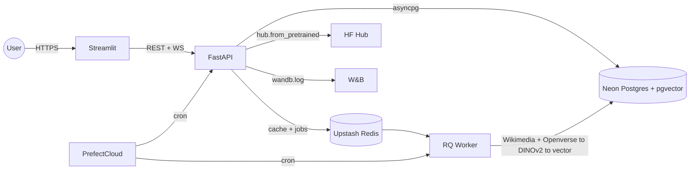

# service

FastAPI backend + Streamlit frontend for the 55-class architectural
style classifier. Inference, segmentation, XAI, kNN search and
optional licensed image expansion (Wikimedia Commons + Openverse,
CC-only) for local docker-compose deployments.



## Modules

| module | tech | role |
| --- | --- | --- |
| `frontend/` | Streamlit, Plotly, httpx | 7 demo pages |
| `backend/` | FastAPI, asyncio, slowapi, structlog | REST / WS API + ML registry |
| `backend/app/ml/` | torch, transformers, sklearn, pgvector | V2-S, ConvNeXt-S, B3, DINOv2 linear, SegFormer-B2, CLIP, HistGBM hybrid, Grad-CAM++, attention rollout |
| `backend/app/db/` | SQLAlchemy 2.0, Alembic, pgvector | images / embeddings / predictions / feedback / classes / scrape_jobs / model_meta |
| `backend/app/tasks/scrape.py` | RQ, requests | RQ job: Wikimedia + Openverse (CC-only) -> DINOv2 -> pgvector |
| `prefect/flows/` | Prefect 3 Cloud | scheduled flows |
| `scripts/` | python | seed_db, bootstrap_classes, train_hybrid, push_models_to_hf, deploy_hf_space, set_space_secrets |
| `locust/` | Locust | 50-vu load test |

Streamlit pages (production navigation):

- Home – overview.
- Try the model – single, ensemble, hybrid, segmentation, Grad-CAM / attention, palette.
- Compare models – all backbones + zero-shot baselines.
- Style atlas – 2D UMAP projection.
- Knowledge base – 55 style cards.
- Feedback – live accuracy + manual labels.
- API docs – Swagger UI of the backend.

## Local

```bash
cd service
cp .env.example .env
make up
make migrate
make seed
docker compose exec backend python -m scripts.bootstrap_classes
docker compose exec backend python -m scripts.train_hybrid
open http://localhost:8501
open http://localhost:8000/docs
```

## Load test

```bash
make load   # 50 vu, 5 RPS, 2 minutes
```

Reference numbers on an M1 CPU:

| endpoint | p50 | p95 | RPS sustained |
| --- | --- | --- | --- |
| `/predict/single` (V2-S) | ~280 ms | ~620 ms | ~6 |
| `/predict/ensemble` | ~720 ms | ~1.3 s | ~2 |
| `/search/similar` (k=5) | ~110 ms | ~280 ms | ~10 |
| `/meta/*` | ~12 ms | ~28 ms | 200+ |

## Deploy

See [`DEPLOY.md`](DEPLOY.md) for docker-compose and free-tier
deployment, and [`DEPLOY_LIVE.md`](DEPLOY_LIVE.md) for the HF Space +
Streamlit Cloud + Neon + Upstash + Prefect Cloud setup.

## Layout

```
service/
  backend/
    app/
      api/{predict,segment,xai,search,scrape,feedback,meta,ws}.py
      ml/{registry,classify,segment,hybrid,xai_cnn,xai_vit,zeroshot,embed,labels,color,preprocess,weights}.py
      db/{base,session,models,migrations}
      tasks/scrape.py
      core/{config,logging,metrics}.py
      utils/images.py
      schemas/predict.py
      main.py
    Dockerfile  Dockerfile.space
    requirements.txt  requirements.space.txt
    space.yaml  README_SPACE.md
  frontend/
    Home.py
    pages/{0,1,2,4,7,8,9}_*.py
    lib/{api,components,plots}.py
    Dockerfile  requirements.txt
  prefect/
    flows/{scrape_round,reembed_index,recalibrate,drift_report}.py
    deployments.py
  scripts/{seed_db,bootstrap_classes,train_hybrid,push_models_to_hf,deploy_hf_space,set_space_secrets}.py
  locust/locustfile.py
  tests/unit/{test_color,test_labels,test_images}.py
  ci/.github/workflows/{ci,deploy-backend}.yml
  docker-compose.yml  Makefile  .env.example
  DEPLOY.md  DEPLOY_LIVE.md
```
